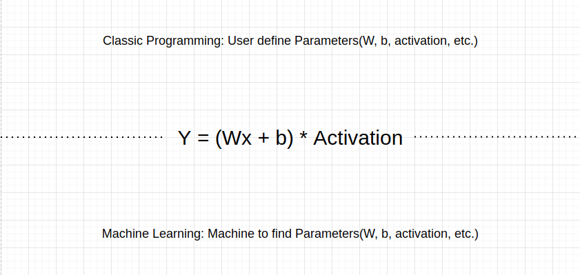
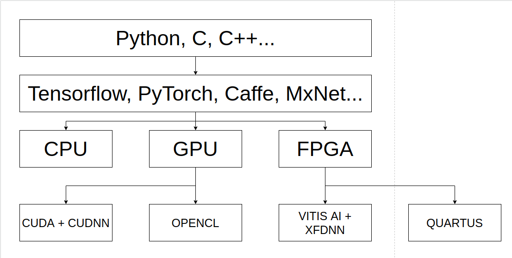
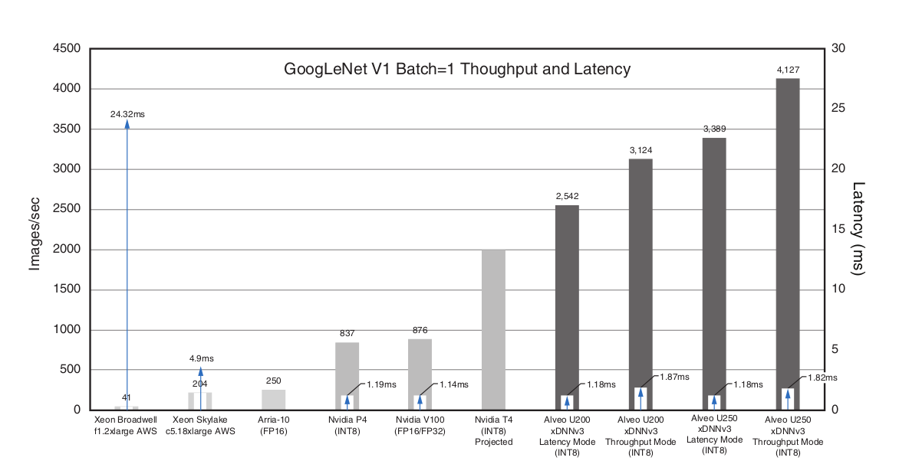

# FPGA vs GPU for machine learning

## What is Machine learning in simple explaination

## Computational Power

|           |   CPU   |   GPU   |   FPGA    |
|-----------|---------|---------|-----------|
| Latency   | fastest |  fast   |   fast    |
| Throughput| too low |  high   |   high    |
| Power     | medium  |  high   |   low     |
| Access    | easy    |  medium |   hard    |

## How machine learning framwork interact with hardware?

## GPU vs FPGA(DPU as interpreted by xilinx)

### for GPU:
  - matrix interpreted as Tensor(ndarray with specific shape and dtype, dtype would usually be f32)
  - Using CUDA + cuDNN (For Nvidia GPU) or OpenCL (supported only a few AMD or other brands' GPU) to map the model + parameter (weights) + input Tensor to GPU memory.
  - With Tensorflow framwork + CUDA (Nvidia GPU), system can ultilize multiple GPUs for single model prediction, training and pruning.
  - Tons of custom models or concepts developed with GPU, and GPU support all kinds of layers, neuron and algorithms.
  - Wide range of products to choose from, Nvidia GTX series, RTX series and Tesla, also Jet for mobile or embedded design
  - Super easy to deploy, most of the framework will do the task for you.
  - With multiple GPUs working parallel, speed is fast enough for most of jobs.
### for FPGA:
  - matrix, models, weights will be quantized(floating point -> fixed point) and loaded into FPGA(still matrix, dtype = INT8)
  - Using Vitis AI + xDNN/xfDNN (xilinx) or OpenVINO (Intel) to map data into FPGA memory and chips.
  - Task running on a single unit at a time, no available module for SLI now.
  - Support most of the base models(ResNet, GoogLeNet, RCNN, FCNN,....), some layers could not loaded into FPGA (softmax,...). Models and layers will be modified by the development kits for HW accelerations.
  - Not much products to choose yet, xilinx alveo series, intel Arrias 10 /10 GX (needs physical modification).
  - Much faster then GPU (4x plus vs GPU when loaded with GoogLeNet), save space (since there's only one unit running), lower power consumption / image processed.
  - Super hard if you holds a device was not originally designed for machine learning.
  

## Why the performance gain/trade off

### INT8 vs float 32:
  INT8 would brings much lower latency and higher throughput compared with float 32 format, but at the same time this format would cost accuracy and precision. By quantization technology, xilinx would overcome this drawbacks on some of the model (ex. ResNet), which partially explain why FPGA supports limit amount of models.
  
### GPU vs Programmable logical unit:
  While cuDNN do have algorithm for convolution and back prop, Alveo on the other hand, fuse the Conv, relu and bias layer in one "layer", also parallel conv and max pooling(downsampling) at the same time, which are huge performance boost for calculation.
  
### FPGA is not a end-to-end model taker:
  Due to lack of support for some of the custom design layers, FPGA has to let the cpu to do this part of jobs, which probably would hurt the performance if a weak cpu is installed or latency caused by communication between FPGA memory and CPU memory. However, GPU does not seem to have this kind of issues, the whole model would be loaded on the GPU as long as the session remained open, even when no input tensor is given (no calculation required).
  
## Further work could do:
  - Instead of using existing vitis AI and xDNN, for specific model we can actually design our own HW acceleration module for DPU, that's what GPU could never achieve in customers' hands.
  - Most of the benchmark done by xilinx or Nvidia comes from system built with one GPU or FPGA inserted. Keep in mind there're many monster server machines out there with 8 Nvidia Tesla V100 card on the same motherboard. Would more GPU working together out rank FPGA? Since FPGA card now has no SLI features.
  - FPGA for ML are more focus on CNN side, which is image processing, will it beats GPU on NLP or other machine learning topics if proper features are implemented? Would customers choose FPGA over GPU just because advantage in computer vision?
