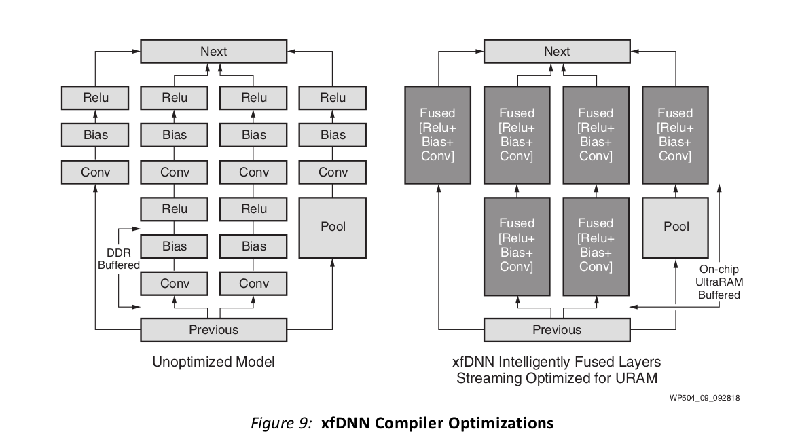
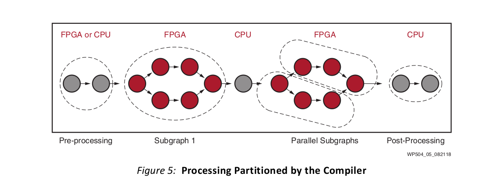

# FPGA vs GPU for machine learning

## What is Machine learning in simple explaination


```
Figure 1
```
Machine learning is to tell the machine to think and solve problems as human. Here is a simple example explaining difference between classic programming and machine learning. Classic programming would require human to define the parameter used, and the program would return Y as result, which is a constant. However, in machine learning case, we would design a training process for machine to learn the parameters themselves, and this process would return a model, which is this whole equation in this case, with parameters calculated by the machine.  Then later on, we will input x to the model for prediction, Y.  The input and the parameters here are matrices with hundreds maybe thousands of dimensions, so extreme parallel computational power is required, and that’s why GPU and FPGA are winners of this game.

## Computational Power

|           |   CPU   |   GPU   |   FPGA    |
|-----------|---------|---------|-----------|
| Latency   | fastest |  fast   |   fast    |
| Throughput| too low |  high   |   high    |
| Power     | medium  |  high   |   low     |
| Access    | easy    |  medium |   hard    |
```
Table 1
```
When talking about computational power, there are actually three platforms to choose. The reason why CPU is not on today’s topic is that, CPU cores are too powerful for this type of calculations, but at the same time CPU has too less cores for high throughput requirement. GPU and FPGA on the other hand, have thousands of cores, which are highly suitable for matrices calculations. 

CPU is not totally out of this game, Since CPU is so easy to access, if you have a computer, you would definitely have a CPU. GPU comes at 2nd place, if you are a gamer, or a computer vision researcher, you are highly possibly holding at least one GPU suitable for machine learning, and most of the majority won’t have FPGA for machine learning as their first choice.

## How machine learning framwork interact with hardware?


Figure 2

So, how does the hardware interact with the software? In normal situation, we will implement the model in programming languages, like python, c, C++. Those programming languages will invoke machine learning API like tensorflow, pytorch.  Those APIs have functions implemented to communicates with the hardware through like say CUDA if you are using Nvidia GPU, OpenCL if you have AMD GPU, at least some of them would work, Vitis AI if you have Xilinx Alveo data accelerate cards or say DPU and compiler if you are only using CPU. 

The matrices will be translated into tensors, which are n dimensional arrays with specific shape and data type. For GPU the data type would be float 16/32, and INT8 if FPGA is used. FPGA uses different architecture for mapping model, it will fuse layers together and quantized the model, which is to change the data type from float 32 to INT 8, while GPU simply transfer the model into its memory.

## GPU vs FPGA(DPU as interpreted by xilinx)

### for GPU:
  - matrix interpreted as Tensor(ndarray with specific shape and dtype, dtype would usually be f32)
  - Using CUDA + cuDNN (For Nvidia GPU) or OpenCL (supported only a few AMD or other brands' GPU) to map the model + parameter (weights) + input Tensor to GPU memory.
  - With Tensorflow framwork + CUDA (Nvidia GPU), system can ultilize multiple GPUs for single model prediction, training and pruning.
  - Tons of custom models or concepts developed with GPU, and GPU support all kinds of layers, neuron and algorithms.
  - Wide range of products to choose from, Nvidia GTX series, RTX series and Tesla, also Jet for mobile or embedded design
  - Super easy to deploy, most of the framework will do the task for you.
  - With multiple GPUs working parallel, speed is fast enough for most of jobs.
### for FPGA:
  - matrix, models, weights will be quantized(floating point -> fixed point) and loaded into FPGA(still matrix, dtype = INT8)
  - Using Vitis AI + xDNN/xfDNN (xilinx) or OpenVINO (Intel) to map data into FPGA memory and chips.
  - Task running on a single unit at a time, no available module for SLI now.
  - Support most of the base models(ResNet, GoogLeNet, RCNN, FCNN,....), some layers could not loaded into FPGA (softmax,...). Models and layers will be modified by the development kits for HW accelerations.
  - Not much products to choose yet, xilinx alveo series, intel Arrias 10 /10 GX (needs physical modification).
  - Much faster then GPU (4x plus vs GPU when loaded with GoogLeNet), save space (since there's only one unit running), lower power consumption / image processed.
  - Super hard if you holds a device was not originally designed for machine learning.
  

Figure 3

## Why the performance gain/trade off

### INT8 vs float 32:
  INT8 would brings much lower latency and higher throughput compared with float 32 format, but at the same time this format would cost accuracy and precision. By quantization technology, xilinx would overcome these drawbacks on some of the model (ex. ResNet), which partially explain why FPGA supports limit amount of models.

Figure 4
  
### GPU vs Programmable logical unit:
  While cuDNN do have algorithm for convolution and back prop, Alveo on the other hand, fuse the Conv, relu and bias layer in one "layer", also parallel conv and max pooling(downsampling) at the same time, which are huge performance boost for calculation. While GPU uses 'brute force' , adding more GPU cores, to accelerate tasks, with hardware acceleration FPGA could easily achieve the same performance with lesser cores running.

Figure 5
  
### FPGA is not a end-to-end model taker:
  Due to lack of support for some of the custom design layers, FPGA has to let the cpu to do this part of jobs, which probably would hurt the performance if a weak cpu is installed or latency caused by communication between FPGA memory and CPU memory. However, GPU does not seem to have this kind of issues, the whole model would be loaded on the GPU as long as the session remained open, even when no input tensor is given (no calculation required).

Figure 6

### System version requirement:
  As powerful as FPGA, it still needs 3rd party package in order to run. Viti-ai and xDNN have highly specific kernel verision, system version, tensorflow version even opencv version requirement. There are no easy way to compile xDNN or XRT, even with system deployed as the documentation required, customers still have to build from source to ensure successful installation. Things get worse if you are holding a FPGA device which is not originally designed for machine learning. ECS.F3.2xlarge on Aliyun and ECS.f1.2xlarge on huaweiCloud has the exact same spec as AWS EC2.f1.x2large but Ml-Suite only runs on AWS's EC2 server. Vitis-ai does not support VU9P MPSoC for now.  As for intel, customers would have to phsyically modify their own cards for these kind of tasks.cuDNN and CUDA on the other hand, have always kept up with the newest version linux, all version of CUDA and cuDNN could be installed via simple .deb package on multiple version of multiple linux distros and have almost no kernel version requirement. 
  
## Further work could do:
  - Instead of using existing vitis AI and xDNN, for specific model we can actually design our own HW acceleration module for DPU, that's what GPU could never achieve in customers' hands.
  - Most of the benchmark done by xilinx or Nvidia comes from system built with one GPU or FPGA inserted. Keep in mind there're many monster server machines out there with 8 Nvidia Tesla V100 card on the same motherboard. Would more GPU working together out rank FPGA? Since FPGA card now has no SLI features. Also Nvidia RTX series gaming graph card can overclock its freq to boost performance, with RTX 3090 on its way to release, GPU might grow more powerful than FPGA.
  - FPGA for ML are more focus on CNN side, which is image processing, will it beats GPU on NLP or other machine learning topics if proper features are implemented? Would customers choose FPGA over GPU just because advantage in computer vision?
  
## Reference:

  - Accelerating DNNs with Xilinx Alveo Accelerator Cards (WP504, v1.0.1) October 14, 2018
  - cuDNN-Developer-Guide DU-06702-001_v8.0.2
  - https://gist.github.com/joelouismarino/a2ede9ab3928f999575423b9887abd14 GoogLeNet (a.k.a Inception V1) tensorflow-keras-gpu
  - https://github.com/Xilinx/ml-suite Xilinx Ml-Suite
  - https://github.com/Xilinx/vitis-ai Xilinx Vitis-AI


